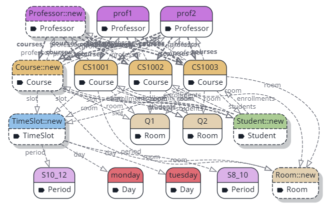
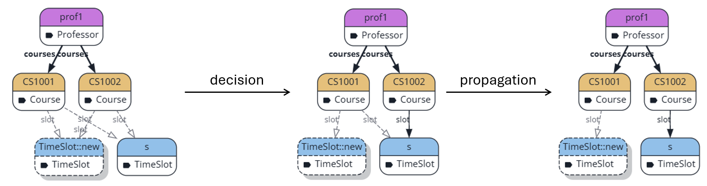

# Advanced Graph-based Modeling Strategies Laboratory

This laboratory aims to introduce advanced graph-based modeling and model generation strategies. The case study of the laboratory is course schedule generation where we have to assign professors and rooms to courses without room conflicts or parallel courses for the same professor. The exercises deal with complex model generation scenarios and present ways to efficiently obtain solutions of the modeling task. While this problem could be formalized and solved using several other techniques (such as constraint solving or SAT), we can easily demonstrate the features and advantages of graph-based partial modeling on this case study. We use Refinery to formulate the problem and obtain models satisfying our constraints.

These exercises can be solved without prior knowledge of Refinery as we provide references to the Refinery documentation at each relevant section. However, being already familiar with the framework is arguably an advantage.

You can always find detailed information about Refinery in its [language reference](https://refinery.tools/learn/language/).

**Deliverables: for this lab, you are required to hand in a markdown file with evidence (screenshots, links, code fragments, etc.) also stored in your repository. Write brief explanations in your report to the inserted evidence.**

Pro tip: the Refinery web editor URL encodes the *Refinery code* (only that and not the generated models) in the editor and automatically updates with each change. This way, you can easily save your model versions after each task if you want. You may also include the links in your submitted report (but you are not required to do so and it does not replace required code fragments).

## Task 0

If you do not have a basic understanding of Refinery, this introduction is crucial for the rest of the laboratory. Feel free to skip this section if you are already familiar with partial modeling and *four-valued logic*. If you still feel unsure of your understanding of partial modelling after reading this section, you can find a more detailed introduction of partial modeling in the [Refinery documentation](https://refinery.tools/learn/language/logic/).

### Four-valued logic

The *Belnap-Dunn four-valued logic* is an extension of standard Boolean logic that can incorporate unknown or contradictory information in the model. Specifically, we have the following truth values:

- `true` values correspond to facts known to hold,
- `false` values correspond to facts known not to hold,
- `unknown` values express uncertain properties (e.g., design decisions yet to be made), and
- `error` values represent contradictions or inconsistencies in the mode.

The model generation task aims to replace all `unknown` values with `true` and `false` values to reduce uncertainty. A model without any `unknown` values is called a concrete model. Model generation can be initiated using the *Generate* button in the top right corner of Refinery.

### Partial modeling

The modeling usually consists of two main phases:

- Defining the *metamodel* of our domain.
- Creating the instance model by specifying assertions.

For example, a file system could have the following simple metamodel:

```
class FileSystem {
    contains Directory[1] root
}

abstract class FileSystemObject {
    container Directory parent opposite contents
}

class Directory extends FileSystemObject {
    contains FileSystemObject[] contents opposite parent
}

class File extends FileSystemObject.
```

You can find a detailed description of classes and references [here](https://refinery.tools/learn/language/classes/). Be sure to understand multiplicities and the differences between simple references and containment references.

We can define the actual objects and the specific constraints in our domain using assertions. An assertion states the value of relation on the given objects. An assertion starts by the asserted value (empty string for `true`, `!` for `false`, `?` for `unknown`), followed by the name of the relation and the relevant objects in parentheses. Consider the following assertions:

```
FileSystem(fs).
File(f1).           % f1 is a node with type File
File(f2).
Directory(dir1).
Directory(dir2).
!File(dir1).        % dir1 does not belong to the File type relation

root(fs, dir1).     % the root of fs is dir1
parent(f1, dir1).
parent(dir2, dir1). % dir2 is in dir1
?parent(f2, dir1).  % we do not know if f2 is in dir1
```

By default, every value is unknown (therefore, setting `?parent(f2, dir1)` in the above example is redundant). However, we can override the default value of a relation:

```
default !File(*).   % objects are not files by default
```

We can define graph predicates that are logic expressions about interesting fragments of the model. Graph predicates are also evaluated according to four-valued logic.

```
pred siblings(FileSystemObject o1, FileSystemObject o2) <->
    Directory(p), parent(o1, p), parent(o2, p).
```

In the above example, the `siblings` predicate is true for any two file system objects residing in the same directory. All objects that do not appear in the signature of the predicate are existentially quantified: for example, the above predicate should be read as "there exists a directory `p` that is both the parent of `o1` and `o2`. Based on our assertions, `siblings(f1, dir2)` is `true` as we specified that the parent of both objects is `dir1`. On the other hand, the value of `siblings(f1, f2)` is `unknown` since we do not know if the parent of `f2` is `dir1`. If you want to access your "global" objects from a predicate, you need to declare such global objects as *atom*s: for example, we may want to refer the (only) file system object in predicates, then we have to add an assertion `atom fs.` to our model. If we want to avoid models where a certain predicate holds, we can add the `error` keyword before `pred` to denote that models where this predicate holds are considered inconsistent. You can read more about graph predicates [here](https://refinery.tools/learn/language/predicates/).

By default, Refinery has an open-world semantics: it can create an arbitrary number of model elements during model generation. If we want to constrain the number of elements in our model, we can set *node scopes* globally or individually for each class. We can also use relative scopes, where we only constrain the newly created nodes (as we may already have some nodes defined via assertions). For example:

```
scope FileSystem = 1,  % a total of 1 node with type FileSystem is allowed
      File += 1234.    % the generated model may contain at most 1234 extra files 
                       % (f1 and f2 defined via assertions are not counted in this 1234)
```

Refinery can also reason about objects that may be created later. This is symbolized with the `<Class>::new` symbol in the visualized partial models (e.g., `File::new`). Since the existence and equality are also relations in the model, we can easily say that the existence of these potential new objects are `unknown` if the scope settings allow the creation of a new node for a given type; we can also say that it is `unknown` whether this `File::new` object is equal to itself since if the scope settings allow the generation of two more `File` nodes, then these two new nodes will not be equal. We refer to a node `o` as a multi-object if `equals(o, o)` is unknown. You can read more about scopes and multi-objects [here](https://refinery.tools/learn/language/logic/#multi-objects).

### Refinery web client

Refinery can be used both as a Java library, a command line tool and via its [web client](https://refinery.services). The web client has several views whose visibility can be toggled in the header:

- The *code* panel contains the textual Refinery code that describes are problem.
- The *graph* panel contains the visual representation of our partial, concrete or generated models.
- We can inspect the values of relations in the *table* panel.
- The *AI* panel integrates an LLM chatbot which can generate a concrete model conforming to our code-based specification and following instructions given as a natural language input.

The *Generate* button generates a model that is a refinement of our partial model. There is a *partial/concrete* toggle next to *Generate*: if set to *partial*, the visualized model exactly visualizes the (partial) information specified by the code, whereas the *concrete* option sets all `unknown` values to `false`. Note that this latter option may produce an inconsistent model.

The Refinery webclient uses solid/filled style for visualizing `true` values, dashed/unfilled style for `unknown` values, and red x-es for `error` values. Multi-objects are denoted by a shadow. Relations on objects with a `false` value are typically not displayed at all. You can check out the introductory example from this section in [Refinery](https://refinery.services/#/1/KLUv_WAdAxUPAIYYRiIgT9wGoz01q_-yw1QZ0UvkPSiBrMgXjDI0cD_t1gkkAmHBPAA6AD0AEA_LZVckt8ts5YWgfbt8CP1lPxnhNLwffM0OpnSRevcdQj1Eb_vJpwtnp9hun_9PFndkc-SQTRnOjO0JLEnMzvbIF2ZJSm61seVr9LfPcNvSea87564fAVBPV5IYpUko6jdaH8-17njWK3bkjKJYwijMkpQSE4s6wj7cJIsCJQwcXGn2i9qEGU6bo_yVD0opPXLO2ZTlw_OeUQLebQJZrsTO9I91EruejyN_o5CU06Z5ulSKQUGjztroO3UT-7xkxqNSfKVTlms5vGLJkYSveR1vfISOt1zr-MrGly4ZBgWNOoLAFwKClY9tTTXs7WNWqJGhUgqVTCk3heYgAkKQg2UHEQAhk87gjKRJsWa6yGd4GzIf20VH1RBTpvbVtoWjjxeroTlUlsQp1ygTLAHYRwDkf-ThhwSsxT4xhGFEH020MkoOcAEBeHJFg6PAEoQRqJmnTAj4TwNVX91GllydSg8gcdVZDFcQKnqtmrSMqfA3SzNN18UjZegz2oZplmk-OsUzAMi6CEvi_Ku8Ko5wXTnoaZ-dLxHcUy_8xZJfy9iQFqcQBPf6kFu2nfVIhKeO9N0DX1QB).

## Task 1 (3p)

The first task is to model our problem and test it on a small hand-crafted example.

### a. Metamodel

The first warm-up task is to create the metamodel of our domain. We want to generate the schedule for courses where each course has a single professor. A professor can give several courses. Students can enroll to courses. Each course should be assigned a (single) room and a (single) time slot. The time slot is characterized by the day of week and the time period. We could model time periods with exact start and end times using integer attributes in Refinery, but that would unnecessarily complicate our case: so let us assume that the courses can only be scheduled to fixed two-hour periods starting every even hour from 8 to 16.

Note: Refinery has a built-in *enum* class for enumerations, but it is more efficient to use a simple class (e.g., called `Day`) and enumerate its instances manually with assertions (e.g., `Day(monday).`). The reason for this difference is that using simple classes, Refinery can use symmetry reductions for days (that is, days are interchangeable and the same schedule with permuted days are considered the same); the same does not apply when using enumerations as the semantics of *enum*s is defined such that the identity of each object matters and they are not interchangeable. That is, we have a much larger design space using enumerations where the same schedule with permutated solutions appear as different solutions.

**Provide the metamodel code and a screenshot of the Refinery partial model view.**

### b. Requirement formalization

Having a metamodel of our problem, we can formalize the requirements of a well-formed schedule. Namely, we want to satisfy the following constraints:

- Two courses that are scheduled to the same time slot cannot have the same room assigned.
- A professor cannot have two courses at the same time slot.

As usual when we require some property to *always hold*, we formalize a predicate for the negation of this constraint: such a predicate characterizes the inconsistent models where the required property is violated. Mark the predicate characterizing violations as `error` predicates. Predicates can refer to other predicates in the predicate body, therefore avoid duplication of the same logic in the code (e.g., the intersection of time slots for two courses appear in both requirements). When matching courses scheduled for the same time slot, ensure that you check that they are not scheduled for the same day and period (that is, you should not simply check if the time slot objects are equal or not as they may point to the same day and period).

**Provide the code for your graph predicates formalizing the above requirements.**

### c. Simple instance model

The next task is to create a simple hand-crafted instance model. Let us have two days (Monday and Tuesday) and two periods (8-10 and 10-12), two professors, three courses and two rooms. We can ignore students for now. Constrain days and periods such that no further instances of these classes can be generated during model generation: you can either achieve this by setting the scopes for these classes or by asserting that no new instances of these classes exist (the assertion `!exists(Day::new)` may be used).

At this point, you should see your defined instances in the partial model view as well as the `::new` multi-objects for each type where it is allowed.

You may also try to generate a concrete model using the *Generate* button, but expect timeouts. Due to the small size of the example, you have chance of successfully generating a model after retrying a few times. Please take a moment to think of a potential issue that may cause this timeout; looking at the generated models (if you were lucky) may give you some hint. If you have a possible reason for the timeouts, please summarize it in your report before continuing. As these timeouts are explained later in this document, we naturally cannot require such an explanation in the submitted report. However, we believe that you can benefit from training your mind to come up with an explanation on your own without reading the "official" reason.

**Provide your assertions that define the objects of your model as well as a screenshot of the partial model view that shows your instances on the partial model.**

At this point, you should have obtained a partial model similar to the one below. Naturally, you may use different names. For example, you should not see `Day::new` or `Period::new` multi-objects.



## Task 2 (3p)

Before diving into the actual exercise, let us briefly study the model generation procedure. The model generation starts from the partial model defined by your code (your metamodel and assertions). In each step of the model generation, we refine of our current model: we replace an `unknown` value with a `true` or a `false` value to obtain a new partial model with less uncertainty. Thus, the model generation explores the design space starting from the initial partial model defined by the assertions. In each state of this process, we may have several options for refinement as we may still have many `unknown` values to concretize, and `true` and `false` may also be valid refinements for the same `unknown` value (resulting in different models). In the introductory example, the location of file `f2` is not specified by our assertions: it may be located in `dir1` and `dir2` as well, thus we can refine `parent(f2, dir1)` (initially `unknown`) to both `true` and `false`. Similarly, we did not limit the number of directories by a scope setting for the `Directory` type, so we can always create a new `Directory` object based on the open-world semantics. So the design space may have many branches based on these different possibilities.

If the model generation reaches an inconsistent partial model after a step (where some element in the partial model has an `error` value), the procedure does not continue exploring that branch of the design space and backtracks to an earlier state and tries to explore other refinements of that partial model. The model generation procedure stops when either a consistent concrete model is reached at a step (that contains no `unknown` and `error` values anymore) or when each possible refinements have been explored from each state of the process and no concrete consistent model have been found. In the latter case, the model generation problem is unsatisfiable.

Thinking about the design space exploration, we can understand the timeouts that we faced in Task 1. Since we have not constrained the scope of several types (only days and time periods were limited), we always have the option to create new objects belonging to these types. Therefore, the model generation procedure can endlessly generate new objects (e.g., students or time slots). So the design space is infinite: hence the timeout. Naturally, we can be lucky such that the model generation finds a branch of the design space that reaches a concrete model in relatively few steps. However, we want to make sure that we always obtain a solution to our problem in finite time. Thus, we either have to guarantee that the design space is finite or choose a design space exploration strategy that can efficiently find solutions.

### a. Quick fix

As a quick fix, limit the number of nodes for each type using *scope* constraints to ensure that the design space for model generation is finite. This way, the model generation should quickly find a solution for your model. Pro tip: you can use `+=` in the scope constraints to limit the number of objects created during the model generation: this way, you do not need to care about the number of objects created by your assertions (see more details in Task 0).

**Include your scope constraints in the submitted report as well as a screenshot of a generated concrete model.**

Ensure that your graph predicates are correctly formalized: modify your assertions so that you only have one room and one time period per day. This way, we have a total of three courses for a total of two different time slots (the same period on two different days) which should not be possible to schedule without a room conflict. Calling model generation with these modified assertions should not return any solution saying that the problem is unsatisfiable.

**Include a screenshot of the unsatisfiable result.**

### b. Advanced model generation strategy

While limiting the number of nodes using scope constraints is an easy and perfect solution in many cases, it may be unrealistic in some scenarios if our problem indeed has an open-world semantics. Even if there is an upper bound for the number of nodes, maybe we cannot or do not want to specify it manually in our model.

In such cases, we can customize the design space exploration strategy to make sure that the model generation quickly finds simple solutions. Staying on the mathematical level, in an infinite design space, a breadth-first search (BFS) always finds solutions at a finite distance from the initial partial model whereas a depth-first search (DFS) may get stuck in an infinite refinement path (e.g., when adding new nodes to the graph endlessly). The DFS is obviously not a viable option, but the BFS is also not very efficient in our case: we can have many refinement possibilities in each step (many `unknown` values that can be refined to both `true` and `false`) yielding a large branching factor which implies that it takes a lot of time for BFS to reach a solution. We, as engineers, can manually guide the search strategy where we expect endless iterations.

First, revert your quick fix with scopes in the previous subtask. Specifically, let us assume that professors, students, courses, rooms, days and periods cannot be created (you can keep the scope constraints for these types). However, we do not want to manually set a scope constraint for time slots. While all possible time slots can easily be obtained by a Cartesian product of days and periods and therefore we could set the scope constraint for the time slot class to the product of the number of days and periods, we refrain from doing so. First, in more complicated scenarios, we could have a case where we cannot easily compute the number of nodes for a given type. Second, it is better from the engineering perspective not to have it hardcoded (we have to change it manually if add a new period for example).

Add all week days and all time periods (every two hour period from 8 to 16) manually to have it for the rest of the tasks.

Our customized strategy will tell Refinery not to create new time slots unless it is absolutely necessary. We have a better term for creating a new object in modeling with open-world semantics: *focusing*. The intuition behind this term is that we already have these objects, simply we do not have them in our registry. Using the Refinery terminology, we have the `<Class>::new` multi-objects and the focusing operation separates one object from the multi-object of its class and tracks the separated object as a distinct entity from that point.

First, add the following import directive to your code to import the necessary annotations:

```
import builtin::strategy.
```

You can disable the automatic focusing ("new object creation") for a class by adding the `@decide(false)` annotation before the class declaration. This way, we competely disable adding new time slots to our model. So if you try to generate a model now, it should fail. We need a manual decision rule that tells when we can add new time slots to our model. Basically, we want to make sure that there are no time slots with the same day and period. We also do not want to have a time slot that just hangs around (and no course is scheduled to this time slot). We can use the following rule to create new time slots:

```
decision rule assignNewTimeSlot(Course c, @focus TimeSlot t, Day d, Period p) <->
    !must timeSlotOnDayAtPeriod(t, d, p)  % precondition
==>
    slot(c, t),     % actions performed when executing this rule
    day(t, d),
    period(t, p).
```

Adjust the class names to your metamodel, if needed. You will need to write a helper query `timeSlotOnDayAtPeriod` which matches a time slot `t`, a day `d`, and a period `p` if there is already a time slot object on a specific day and period (this is a *very* simple query, you should not overcomplicate your solution).

The precondition of the decision rule uses the `must` modality: the `must` modifier means that we can only execute the rule if the modified predicate is sure to have the value `true` (that is, we cannot execute the rule if the value of this predicate is `unknown`). Having the negated condition means that the `assignNewTimeSlot` rule can only be applied if `timeSlotOnDayAtPeriod` does not have a value `true` (that is, `false`, `unknown`, or `error`). The `@focus` annotation in the rule header specifies that the time slot object `t` is a newly separated object from `TimeSlot::new` upon executing this rule. The second part of the rule describes what new values should be set after executing the rule: namely, setting the day and period of the time slot to the matched values and also setting the slot of the given course to this new time slot.

With this rule, we can make sure that the model generation does not create redundant time slot objects. This way, model generation should be fast on your small hand-crafted instances.

**Provide your helper predicate and a screenshot about the generated model.**

## Task 3 (4p)

In the last task, we will look at another aspect of model generation: propagation rules. We can use propagation rules to add further knowledge based on existing knowledge that the model generator cannot infer by itself. This is typically based on specific domain-knowledge. Propagation rules are called by the model generator after each refinement step: a propagation rule is executed whenever its precondition is true based on the existing knowledge in our partial model. If a propagation rule is executed, the knowledge described in its second part is added to the partial model. The required semantics of propagation rules are that they should not exclude consistent (valid) models when executed.

Using propagation rules have two main advantages:
- We can make the search space exploration more efficient. Currently, our well-formedness constraints are formulated as error predicates which means that the model generator has to go all the way with the refinement steps to reach an inconsistent model to discard a branch of the explored design space. Formulating our requirements using propagation rules (as well), we can much earlier detect contradicting values.
- We can reason about uncertain aspects of the model: that is, we do not need a model that already satisfies the precondition of our propagation rule. We can only say that if certain preconditions hold for the values in the model at some point, then we also want to fix some other values.

We will see both of these advantages with an example in our case study. However, let us start with some data preparation so that we can test with larger data whether propagation indeed improves the model generation performance.

### a. Data preparation

You can download a prepared dataset with more courses, professors, rooms, and students from [here](). The data is given as a "natural language" input, but you can easily use some regex queries to convert them to Refinery assertions according to your metamodel. We suggest to use your favourite LLM to generate a script (shell or python) that converts this input to valid Refinery assertions.

When a professor-course pair is not explicitly mentioned in the input, we assume that the specific professor cannot lead that specific course. Similarly assumptions with not included student-course pairs. Make sure to reflect these implicit assumptions in your model (hint: use `default` assertions).

**Include your AI prompt you used during the input conversion. Describe the conversion method. Provide your converted assertions in the submitted report.**

Even with the guided search strategy implemented in Task 2b, model generation should timeout (or at least take quite some seconds to complete).

### b. Implement propagation

Consider the second requirement from Task 1b: *a professor cannot have two courses at the same time slot*. You have already formulated this as an error predicate to exclude models where a professor has several courses scheduled for the same time slot. Now, you should also formulate a propagation rule for this requirement in the following sense: *if a professor already has a course scheduled for certain time slot, then another course delivered by the same professor should not be scheduled for the same time slot*. This is indeed a *proactive* description of our requirement that can be useful during model generation.

First, let us inspect how propagation works in action during the model generation process. Let us assume that the model generation reaches a partial model corresponding to the leftmost model in the figure below (other classes and references are hidden for better readability). In this partial model, both courses can be scheduled to both the time slot named `s` or to a potential new time slot.  Then, let us assume that the model generation process makes a decision to refine the `unknown` value of `slot(CS1002, s)` to `true` and refine all other `slot` references from `CS1002` to `false` simultaneously: see the changed arrow styles in the figure. After this decision, the propagation automatically triggers, as we have two courses of the same professor with one already scheduled to the specific time slot `s`. The propagation removes the dashed slot edge from the other course to `s`: that is, `slot(CS1001, s)` is refined to `false`.



The propagation rule can be written in the following format:

```
propagation rule professorTimeSlotNotAvailable(Course other, TimeSlot s) <->
    % TODO rule precondition
==>
    % TODO ensure that the `other` course is not scheduled for the same slot `s`
    .
```

Note: you only need to include those objects in the rule header that are used in its second part, the other objects used in the precondition are existentially quantified (similarly to simple predicates). So you can naturally use further symbols in the precondition (not only `other` and `s`).

Observe the benefits of using this propagation rule:
- The implemented propagation rule should cut off branches of the design space during model generation. For example, if we already know that a professor has a course on Monday at 8-10, then all branches of the design space where another course of this professor is also scheduled for the same slot. That is, the model generation does not even explore these branches whereas previously it had to explore all of those refinements as well before reaching an inconsistent model and realizing that the error predicate is violated.
- We could define this propagation rule with uncertainty in the initial model: in the initial model, no courses are scheduled, but we could already describe this rule for partial models reached later during model generation.

Implement a similar propagation rule for the first requirement in Task 2b regarding room conflicts: *if two courses are already scheduled for the same time slot and a specific room is already assigned to one of the courses, the same room cannot be assigned to the other course*.

With the help of these propagation rules, the model generation should quickly find a solution for the problem.

**Add your propagation rule implementations to your report. Include a screenshot of the generated model, as well. For better readability, hide student nodes and all references pointing to or from student nodes by disabling the (left) checkboxes in the view configuration of the Refinery graph panel.**

## Task 4 (optional, 2p)

This extra task is intended for those who quickly finish with the other tasks. As a motivation, you can also get 2 extra points if you correctly complete this task (if you do not exceed the maximum points).

Since people are often less productive on Friday, the university schedule policy intends to avoid courses being scheduled for Friday, if possible. Extend your model in a way to only schedule courses for Friday if they could not be scheduled earlier in the week without violating one of our two main requirements listed in Task 2b.

Demonstrate that your solution works well with two minimal hand-crafted examples: in one case, the courses should fit in time slots on other days; in the other case, they should not fit and some course(s) should be scheduled for Friday. Use as few objects in your test examples as possible. You may also decrease the number of days and periods for this: keep Monday, Tuesday and Friday and two periods per day in the model.

**Describe your solution in the submitted report and include the relevant code fragments. Submit your minimal instances as well for the two test cases described in the previous paragraph along with generated models for the two cases.**

<details>
    <summary>Hint</summary>
    <br>
    <p>Divide the decision rule written for Task 2b to separately handle the creation of a new time slot for Friday and for other days of the week. The rule creating time slots on Friday should ensure in its precondition that there is no option for the current course to be scheduled on another day without a room or professor conflict. Basically, the precondition of this latter rule creating time slots on Friday should not be satisfied in the following two cases: 1) there is a time slot on an other day when no courses have been scheduled at all, and 2) all other time slots already have courses but there is a time slot among these when no conflicting course is scheduled with the currently handled course. In these two cases, we should not create a time slot for Friday, as the current course can be put on an other day.</p>
    <p>You may need to create helper queries and you may want to use the `must` modality modifier in these helper queries: if you want to use the `must` modifier in a predicate, you need to add the `shadow` keyword before the `pred` keyword.</p>
</details>
